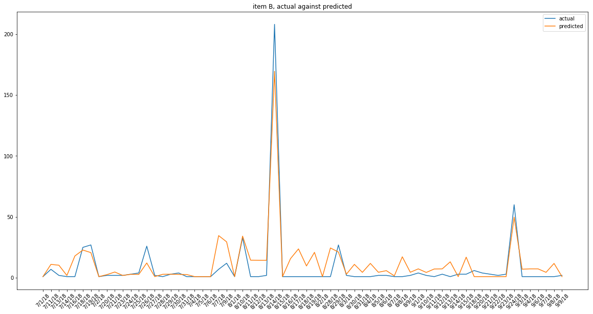

```python
%matplotlib inline
import matplotlib.pyplot as plt
import pandas as pd
import numpy as np
import statsmodels.api as sm
from sklearn import linear_model
from aggregate_functions import preprocessing_data, regression_model_items, optimization_fitting
```

## Contents
1. Basic exploratory analysis
1. Modeling details

### Basic exploratory analysis of current data
- check total demand of each day
- the undiscounted price of the item
- are most items on discount each day

#### Total demand of each day
- huge spikes on days --> influenced by sales


```python
total_demand = (
    processing_data.include_predictors_processed
    .groupby(['date_id','itemid'])
    .agg({"amount":"sum"})
    .reset_index()
)

plt.figure(figsize=(15,5))

plt.subplot(1, 3, 1)
plt.plot(total_demand.query("itemid=='A'").date_id, total_demand.query("itemid=='A'").amount)
plt.title("itemA")
plt.xticks(rotation=45)

plt.subplot(1, 3, 2)
plt.plot(total_demand.query("itemid=='B'").date_id, total_demand.query("itemid=='B'").amount)
plt.title("itemB")
plt.xticks(rotation=45)

plt.subplot(1, 3, 3)
plt.plot(total_demand.query("itemid=='C'").date_id, total_demand.query("itemid=='C'").amount)
plt.title("itemC")
plt.xticks(rotation=45)


plt.tight_layout()

```


#### Undiscounted price of each item
- item A: ~53
- item B: ~123
- item C: ~105


```python
undiscounted_price = (
    processing_data.include_predictors_processed
    .groupby(['price_before_discount_usd','itemid'])
    .agg({"amount":"sum"})
    .reset_index()
)
undiscounted_price
```


<div>
<style scoped>
    .dataframe tbody tr th:only-of-type {
        vertical-align: middle;
    }

    .dataframe tbody tr th {
        vertical-align: top;
    }

    .dataframe thead th {
        text-align: right;
    }
</style>
<table border="1" class="dataframe">
  <thead>
    <tr style="text-align: right;">
      <th></th>
      <th>price_before_discount_usd</th>
      <th>itemid</th>
      <th>amount</th>
    </tr>
  </thead>
  <tbody>
    <tr>
      <th>0</th>
      <td>51.922137</td>
      <td>A</td>
      <td>458</td>
    </tr>
    <tr>
      <th>1</th>
      <td>53.170178</td>
      <td>A</td>
      <td>515</td>
    </tr>
    <tr>
      <th>2</th>
      <td>53.434224</td>
      <td>A</td>
      <td>112</td>
    </tr>
    <tr>
      <th>3</th>
      <td>102.744274</td>
      <td>C</td>
      <td>21</td>
    </tr>
    <tr>
      <th>4</th>
      <td>105.240356</td>
      <td>C</td>
      <td>158</td>
    </tr>
    <tr>
      <th>5</th>
      <td>105.768448</td>
      <td>C</td>
      <td>54</td>
    </tr>
    <tr>
      <th>6</th>
      <td>108.419489</td>
      <td>C</td>
      <td>36</td>
    </tr>
    <tr>
      <th>7</th>
      <td>109.162417</td>
      <td>C</td>
      <td>143</td>
    </tr>
    <tr>
      <th>8</th>
      <td>110.075197</td>
      <td>C</td>
      <td>3</td>
    </tr>
    <tr>
      <th>9</th>
      <td>110.700038</td>
      <td>C</td>
      <td>2</td>
    </tr>
    <tr>
      <th>10</th>
      <td>119.733551</td>
      <td>B</td>
      <td>81</td>
    </tr>
    <tr>
      <th>11</th>
      <td>122.738300</td>
      <td>B</td>
      <td>23</td>
    </tr>
    <tr>
      <th>12</th>
      <td>123.580351</td>
      <td>B</td>
      <td>287</td>
    </tr>
    <tr>
      <th>13</th>
      <td>124.614916</td>
      <td>B</td>
      <td>136</td>
    </tr>
    <tr>
      <th>14</th>
      <td>125.323125</td>
      <td>B</td>
      <td>5</td>
    </tr>
  </tbody>
</table>
</div>


#### Amount of items sold on discount each day
- it seems like most of the items sold on each day has some of discount
- this hints to us that there are multiple price points of each item, and a multiple regression is suited to tackle this problem


```python
are_most_on_discount = (
    processing_data.include_predictors_processed
    .groupby(['date_id','itemid'])
    .agg({"amount":"sum","is_discount":"sum"})
    .reset_index()
    .pipe(lambda x:x.assign(percentage = x.is_discount/x.amount))
)

are_most_on_discount.percentage.unique()
```


    array([1.])


### Model details
1. Demand generation forecast
1. Accuracy of demand generation
1. Price optimization

### Demand generation forecast
- based on:
    - price of all other products
    - is promotion present
    - is-weekday
    - is-weekend
    - is-holiday
    - previous period demand (introduce auto-correlation of some sort)
    - log-level (not always)
- each product will have a representation
- Example:
    - $\beta_{0} + \beta_{1}P_{i} + \beta_{2}PromotionPresent + \beta_{3}isWeekDay + \beta_{4}isWeekEnd + \beta_{5}isHoliday + \beta_{6}PreviousPeriodDemand + \epsilon$


```python
processing_data = preprocessing_data.PreprocessingData("data/unknown-2018.csv","data/indo_public_holidays.csv")

processing_data.total_demand_A.head()
```


<div>
<style scoped>
    .dataframe tbody tr th:only-of-type {
        vertical-align: middle;
    }

    .dataframe tbody tr th {
        vertical-align: top;
    }

    .dataframe thead th {
        text-align: right;
    }
</style>
<table border="1" class="dataframe">
  <thead>
    <tr style="text-align: right;">
      <th></th>
      <th>date_id</th>
      <th>itemid</th>
      <th>is_weekday</th>
      <th>is_weekend</th>
      <th>is_holiday</th>
      <th>amount</th>
      <th>weighted_price_usd</th>
      <th>previous_day_demand</th>
      <th>is_promotion</th>
    </tr>
  </thead>
  <tbody>
    <tr>
      <th>0</th>
      <td>2018-07-01</td>
      <td>A</td>
      <td>0</td>
      <td>1</td>
      <td>0.0</td>
      <td>1</td>
      <td>49.869566</td>
      <td>0.0</td>
      <td>1</td>
    </tr>
    <tr>
      <th>1</th>
      <td>2018-07-02</td>
      <td>A</td>
      <td>1</td>
      <td>0</td>
      <td>0.0</td>
      <td>1</td>
      <td>49.869566</td>
      <td>1.0</td>
      <td>1</td>
    </tr>
    <tr>
      <th>2</th>
      <td>2018-07-04</td>
      <td>A</td>
      <td>1</td>
      <td>0</td>
      <td>0.0</td>
      <td>53</td>
      <td>37.644807</td>
      <td>1.0</td>
      <td>1</td>
    </tr>
    <tr>
      <th>3</th>
      <td>2018-07-05</td>
      <td>A</td>
      <td>1</td>
      <td>0</td>
      <td>0.0</td>
      <td>1</td>
      <td>50.725084</td>
      <td>53.0</td>
      <td>1</td>
    </tr>
    <tr>
      <th>4</th>
      <td>2018-07-06</td>
      <td>A</td>
      <td>1</td>
      <td>0</td>
      <td>0.0</td>
      <td>3</td>
      <td>50.725084</td>
      <td>1.0</td>
      <td>1</td>
    </tr>
  </tbody>
</table>
</div>


### Demand generation forecast


```python
regression_model_output = regression_model_items.RegressionModel('data/output_numbers_A.csv','data/regressionB.csv','data/regressionC.csv')
```

### Accuracy of demand generation


```python
fitting_of_model = optimization_fitting.ModelFitting('data/output_prediction_A.csv','data/output_prediction_B.csv','data/output_prediction_C.csv')
```

    Start of item A:
    average quantity demanded for A across time series: 16.44
    RMSE for A: 1.52
    error margin for A: 0.09


    Start of item B:
    average quantity demanded for B across time series: 8.06
    RMSE for B: 1.92
    error margin for B: 0.24





    Start of item C:
    average quantity demanded for C across time series: 6.32
    RMSE for C: 1.11
    error margin for C: 0.18


### Price optimization
- The basic idea is we have Q in terms of P
- $TotalRev$ = $Q_a$ * $P_a$ + $Q_b$ * $P_b$ + $Q_c$ * $P_c$
    - optimizing revenue, we will partial differentiate the revenue with respect to each item
    - $\frac{\partial TotalRev}{\partial P_a} = 0$, $\frac{\partial TotalRev}{\partial P_b} = 0$, $\frac{\partial TotalRev}{\partial P_c} = 0$
    - it becomes a system of linear equation, and can be solved easily


```python
def generic_price_optimization_function(is_weekday, is_weekend, is_holiday, 
                                        is_promotion_first, is_promotion_second,
                                        model_param_A, model_param_B, model_param_C):
    model_param_A_df = (
        pd.DataFrame(testing_model.model_params_A)
        .T
    )
    
    model_param_B_df = (
        pd.DataFrame(testing_model.model_params_B)
        .T
    )
    
    model_param_C_df = (
        pd.DataFrame(testing_model.model_params_C)
        .T
    )
    
    constant_A = (
        model_param_A_df.const.values[0] + is_weekday * model_param_A_df.is_weekday.values[0] 
        + is_weekend * model_param_A_df.is_weekend.values[0] + is_holiday * model_param_A_df.is_holiday.values[0]
        + fitting_of_model.prediction_fitting_A * model_param_A_df.previous_day_demand.values[0]
        + is_promotion_first * model_param_A_df.is_promotion_B.values[0]
        + is_promotion_second * model_param_A_df.is_promotion_C.values[0]
    )
    
    constant_B = (
        model_param_B_df.const.values[0] + is_weekday * model_param_B_df.is_weekday.values[0] 
        + is_weekend * model_param_B_df.is_weekend.values[0] + is_holiday * model_param_B_df.is_holiday.values[0]
        + fitting_of_model.prediction_fitting_B * model_param_B_df.previous_demand.values[0]
        + is_promotion_first * model_param_B_df.is_promotion_A.values[0]
        + is_promotion_second * model_param_B_df.is_promotion_C.values[0]
    )
    
    constant_C = (
        model_param_C_df.const.values[0] + is_weekday * model_param_C_df.is_weekday.values[0] 
        + is_weekend * model_param_C_df.is_weekend.values[0] + is_holiday * model_param_C_df.is_holiday.values[0]
        + fitting_of_model.prediction_fitting_C * model_param_C_df.previous_demand.values[0]
        + is_promotion_first * model_param_C_df.is_promotion_B.values[0]
        + is_promotion_second * model_param_C_df.is_promotion_A.values[0]
    )
    
    constant_numeric = np.array([[-1*constant_A],[-1*constant_B],[-1*constant_C]])
    
    item_A_first = model_param_A_df.weighted_price_usd_A.values[0] * 2
    item_A_second = model_param_A_df.weighted_price_usd_B.values[0] + model_param_B_df.weighted_price_usd_A.values[0]
    item_A_third = model_param_A_df.weighted_price_usd_C.values[0] + model_param_C_df.weighted_price_usd_A.values[0]
    
    item_B_first =item_A_second
    item_B_second = model_param_B_df.weighted_price_usd_B.values[0] * 2
    item_B_third = model_param_B_df.weighted_price_usd_C.values[0] + model_param_C_df.weighted_price_usd_B.values[0]
    
    item_C_first = item_A_third
    item_C_second = model_param_C_df.weighted_price_usd_B.values[0] + model_param_B_df.weighted_price_usd_C.values[0]
    item_C_third = model_param_C_df.weighted_price_usd_C.values[0] * 2
    
    model_variables_matrix = np.array([[item_A_first, item_A_second, item_A_third],[item_B_first,item_B_second,item_B_third],[item_C_first,item_C_second,item_C_third]])
    
    values = np.linalg.solve(model_variables_matrix, constant_numeric)
    return values
    
```


```python
generic_price_optimization_function(1,0,0,0,0,model_param_A_df,model_param_B_df,model_param_C_df)
```


    array([[17.88810439],
           [41.13139183],
           [81.72909101]])


### Recommendations for price
- A: 53 to 17.89
- B: 123 to 41.13
- C: 105 to 81.73

### Expected uplife in revenue from recommendation
- using the same constraint as above
    - is_weekday: 1
    - is_weekend: 0
    - is_holiday: 0
    - is_promotion_first: 0
    - is_promotion_second: 0
- +34% uplift in revenue


```python
original_demand_A =  (
    model_param_A_df.const.values[0] 
    + model_param_A_df.is_weekday.values[0]
    + model_param_A_df.previous_day_demand.values[0] * 16.44 
    + model_param_A_df.weighted_price_usd_A.values[0] * original_price_A
    + model_param_A_df.weighted_price_usd_B.values[0] * original_price_B 
    + model_param_A_df.weighted_price_usd_C.values[0] * original_price_C
)

new_demand_A =  (
    model_param_A_df.const.values[0] 
    + model_param_A_df.is_weekday.values[0]
    + model_param_A_df.previous_day_demand.values[0] * 16.44 
    + model_param_A_df.weighted_price_usd_A.values[0] * 17.88810439
    + model_param_A_df.weighted_price_usd_B.values[0] * 41.13139183 
    + model_param_A_df.weighted_price_usd_C.values[0] * 81.72909101
)
```


```python
original_demand_B =  (
    model_param_B_df.const.values[0] 
    + model_param_B_df.is_weekday.values[0]
    + model_param_B_df.previous_demand.values[0] * 8.06
    + model_param_B_df.weighted_price_usd_A.values[0] * original_price_A
    + model_param_B_df.weighted_price_usd_B.values[0] * original_price_B 
    + model_param_B_df.weighted_price_usd_C.values[0] * original_price_C
)

new_demand_B =  (
    model_param_B_df.const.values[0] 
    + model_param_B_df.is_weekday.values[0]
    + model_param_B_df.previous_demand.values[0] * 8.06
    + model_param_B_df.weighted_price_usd_A.values[0] * 17.88810439
    + model_param_B_df.weighted_price_usd_B.values[0] * 41.13139183 
    + model_param_B_df.weighted_price_usd_C.values[0] * 81.72909101
)
```


```python
original_demand_C =  (
    model_param_C_df.const.values[0] 
    + model_param_C_df.is_weekday.values[0]
    + model_param_C_df.previous_demand.values[0] * 6.32
    + model_param_C_df.weighted_price_usd_A.values[0] * original_price_A
    + model_param_C_df.weighted_price_usd_B.values[0] * original_price_B 
    + model_param_C_df.weighted_price_usd_C.values[0] * original_price_C
)

new_demand_C =  (
    model_param_C_df.const.values[0] 
    + model_param_C_df.is_weekday.values[0]
    + model_param_C_df.previous_demand.values[0] * 6.32
    + model_param_C_df.weighted_price_usd_A.values[0] * 17.88810439
    + model_param_C_df.weighted_price_usd_B.values[0] * 41.13139183 
    + model_param_C_df.weighted_price_usd_C.values[0] * 81.72909101
)
```


```python
original_total_revenue = (
    original_demand_A * original_price_A
    + original_demand_B * original_price_B
    + original_demand_C * original_price_C
)

new_total_revenue = (
    new_demand_A * 17.88810439
    + new_demand_B * 41.13139183 
    + new_demand_C * 81.72909101
)

print("Original total revenue: $" + str(round(original_total_revenue,2)))
print("New total revenue: $" + str(round(new_total_revenue,2)))
print("percentage increase in revenue: " + str(round((new_total_revenue/original_total_revenue-1) * 100,2)) + "%")
```

    Original total revenue: $18305.72
    New total revenue: $24514.65
    percentage increase in revenue: 33.92%

